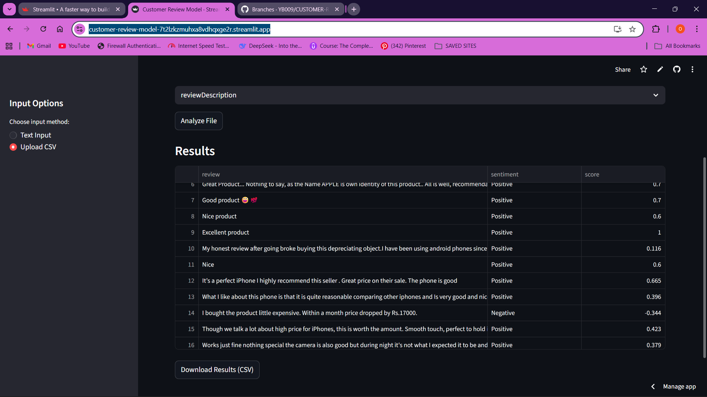

# Customer Review Sentiment Analyzer


Programming Language: Python

Web Framework: Streamlit

NLP Library: TextBlob

Text Processing: NLTK

Data Handling: Pandas


## STREAMLIT USAGE
This project is a **Streamlit-based web application** for analyzing customer review sentiment using **TextBlob**.  
Users can either paste reviews directly or upload a CSV file and analyze reviews in bulk.

The app classifies each review as **Positive**, **Negative**, or **Neutral** based on sentiment polarity.

---

## 🚀 Live Application

You can access the deployed app here:

👉 https://customer-review-model-7t2lzkzmuhxa8vdhqxge2r.streamlit.app/

No installation is required to use the live version.

---

## 🖼️ Application Screenshot


LIVE APP SCREENSHOT
> 📸 ****

## Features

- Sentiment analysis of customer reviews
- Text-based input (one review per line)
- Drag-and-drop CSV file upload
- User-selected review description column
- Batch processing of reviews
- Tabular visualization of results
- Downloadable CSV output
- Fully cloud-deployed using Streamlit Community Cloud

---

## Methodology

### Sentiment Analysis Technique

The application uses **TextBlob**, a lexicon-based natural language processing library, to compute sentiment polarity.

- Polarity range: **-1.0 (negative)** to **+1.0 (positive)**
- Classification criteria:
  - **Positive** → polarity > 0
  - **Negative** → polarity < 0
  - **Neutral** → polarity = 0

This approach is **rule-based** and does not rely on a trained machine learning classifier.

---

## How to Use the Application

### Option 1: Manual Text Input
1. Enter customer reviews in the text box
2. Use **one review per line**
3. Click **“Analyze Reviews”**
4. View and download results

---

### Option 2: CSV File Upload
1. Upload a `.csv` file using drag-and-drop
2. **Select the column that contains the customer review descriptions**
3. Click **“Analyze File”**
4. View results and download the processed file

⚠️ **Important:**  
The application does not assume a predefined column name.  
You must explicitly select the column that contains the review text.

---

## Example CSV Format

An example CSV file is provided to demonstrate the expected structure.

```text
review_description
Great service and friendly staff.
The product quality was disappointing.
Delivery was on time and well packaged.


### LOCAL USE
## Installation

1. Clone the repository:
```bash
git clone <repository-url>
cd <project-directory>
```

2. Create a virtual environment:
```bash
python -m venv venv
source venv/bin/activate  # On Windows: venv\Scripts\activate
```

3. Install dependencies:
```bash
pip install -r requirements.txt
```

## Usage

1. Start the web server:
```bash
python app/main.py
```

2. Open your browser and navigate to `http://localhost:5000`

3. Enter your reviews in the text area and click "Analyze Topics"

## API Endpoints

- `POST /analyze`: Analyze reviews and return topics
  - Request body: `{"reviews": ["review1", "review2", ...]}`
  - Response: `{"topics": [["word1", "word2", ...], ...]}`

## Dependencies

- Flask
- NumPy
- NLTK
- Flask-CORS

## License

This project is licensed under the MIT License and is intended for educational and demonstration use.

## Contributing

1. Fork the repository
2. Create your feature branch
3. Commit your changes
4. Push to the branch
5. Create a new Pull Request